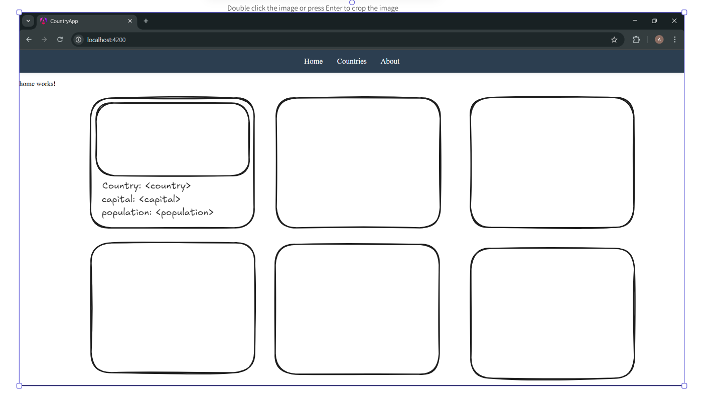
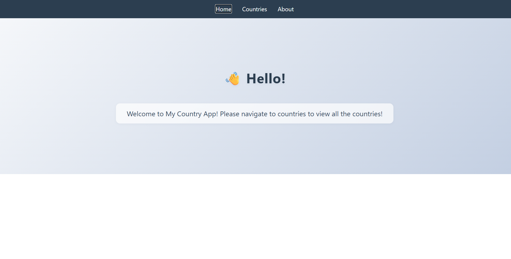
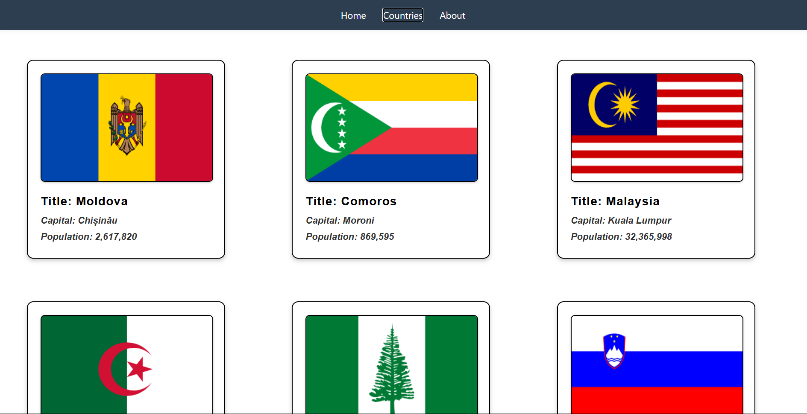
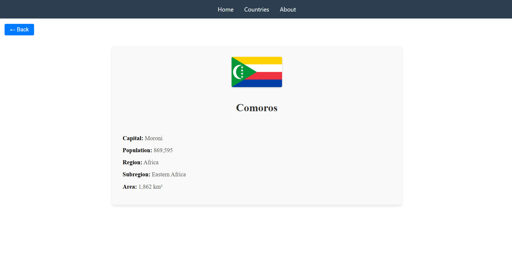
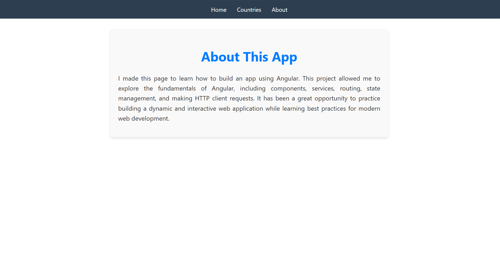

# Country App

This project is a simple Angular application designed to explore and learn the fundamentals of Angular development. It showcases the use of components, services, routing, state management, and HTTP client requests to build a dynamic and interactive web application.

## Features

- **Country List**: Displays a list of countries fetched from the REST Countries API.
- **Country Details**: Shows detailed information about a selected country, including its flag, capital, population, region, subregion, and area.
- **Loading Spinner**: Provides a visual indicator while data is being fetched.
- **Back Navigation**: Allows users to navigate back to the previous page.
- **About Page**: Describes the purpose of the project and the technologies used.

## Technologies Used

- **Angular**: Framework for building the application.
- **REST Countries API**: Source of country data.
- **SCSS**: Styling for the application.
- **RxJS**: For handling asynchronous data streams.

## Angular Basics and Features Used

1. **Components**:
   - Modular and reusable building blocks for the application.
   - Examples: `Header`, `Card`, `Loading`, `About`.

2. **Directives**:
   - `*ngIf`: Conditional rendering of elements.
   - `@for`: Iterating over lists in templates.

3. **Pipes**:
   - `titlecase`: Formatting text to title case.
   - `number`: Formatting numbers like population and area.

4. **Routing**:
   - Navigation between pages using Angular Router.
   - Routes include Home, Countries, Country Details, and About.

5. **HTTP Client**:
   - Fetching data from the REST Countries API using Angular's `HttpClient`.

6. **State Management**:
   - Signals for managing reactive state, such as `loading` and `country`.

7. **Data Binding**:
   - Passing data between components using `@Input` and `@Output`.

8. **Styling**:
   - SCSS for component-specific and global styles.

9. **Error Handling**:
   - Using `catchError` from RxJS to handle API errors gracefully.

10. **Dynamic Templates**:
    - Using Angular's template syntax for dynamic content rendering.

## How to Run

1. Clone the repository:

   ```bash
   git clone https://github.com/devAmjad4590/country-app.git
   ```

2. Navigate to the project directory:

   ```bash
   cd country-app
   ```

3. Install dependencies:

   ```bash
   npm install
   ```

4. Start the development server:

   ```bash
   npm start
   ```

5. Open your browser and navigate to `http://localhost:4200/`.

## Screenshots

### Wireframe
First, I drew a quick wireframe using excalidraw just to get a better hang of how the page should look like.


### Home Page
This is the landing page of the application, providing an introduction and navigation options.


### Countries Page
This page dispays list of countries retrieved by making HTTP request, and place them into grids with their name, capital and population displayed.


### Country Details Page
This page displays detailed information about a selected country, including its flag, capital, population, and more.


### About Page
This page explains the purpose of the application and the technologies used.


## Learning Outcomes

- Understanding Angular components, services, and routing.
- Managing state and handling asynchronous data with RxJS.
- Styling applications using SCSS.
- Making HTTP client requests to fetch and display data.

## License

This project is licensed under the MIT License.
